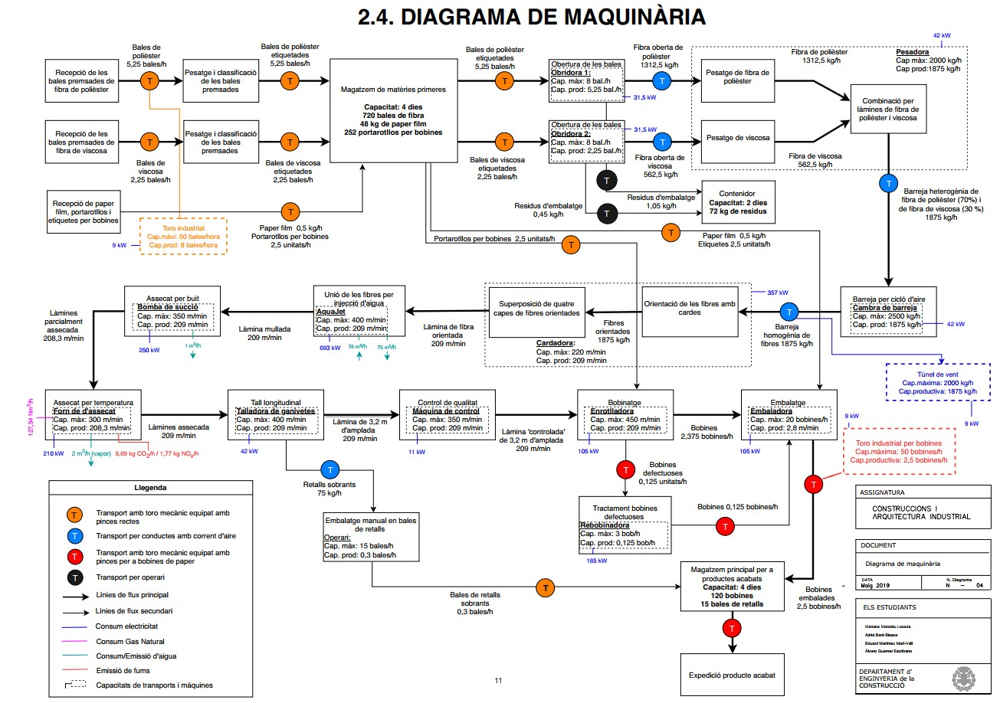
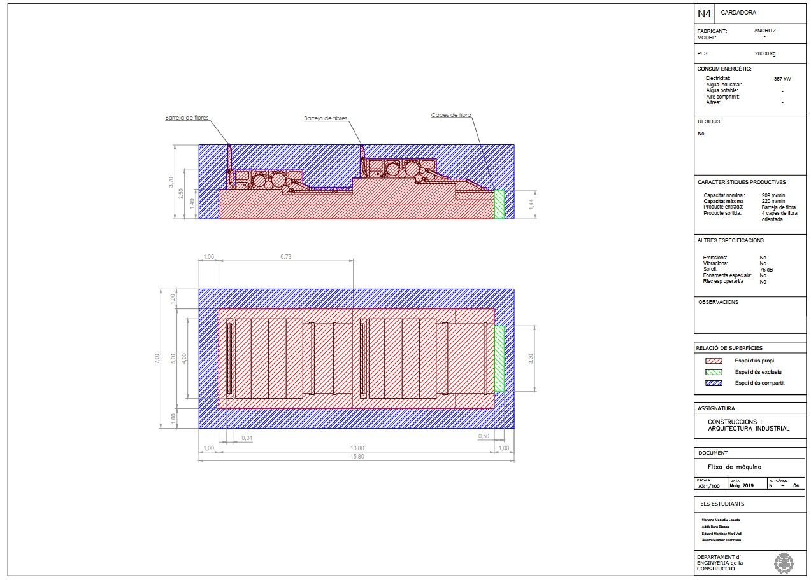
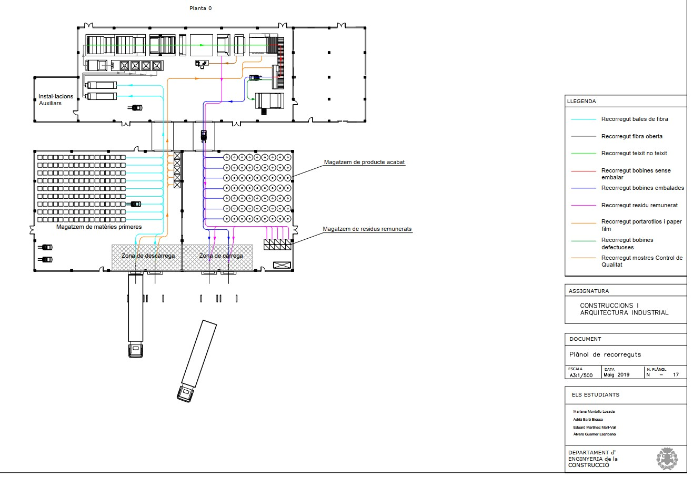

## Implementation of a nonwoven fabric industrial plant

### DESCRIPTION
The project was the main purpose of the *Constructions and Industrial Architecture* course, at MSc level. This course intended to provide knowledge in the relation between industrial-economic activities and its physical environment together with the industrial building construction. This was to be achieved with theoretical lectures as well as a more practical approach with the project presented here.

### OBJECTIVES
The main goal was to implement an industrial building adapted to a specific production process. Secondary goals were to apply the current regulations and draw production, machine and construction drawings using AutoCAD.

### METHODOLOGY
#### INDUSTRIAL VISIT
The project started with a visit to the [BCN NonWovens](http://www.bcnonwovens.com/) industrial plant. This company manufactures non-woven fabric rolls for customers in different markets i.e. medical care or home care. During the visit, the company explained to us how the factory is organized, the machines they use, production numbers, etc. Also, we were shown the production line and the different buildings.
Thanks to the visit and constant communication with the company, activity, flow, machines and production diagrams were prepared to have a better overview of the industrial plant organization. The machine diagram can be observed in *Fig. 1*.

<figure>
  
  <figcaption>Fig.1: Flow diagram</figcaption>
</figure>

#### INDUSTRIAL BUILDING DESIGN

<figure>
  
  <figcaption>Fig.2: Preliminary design drawing</figcaption>
</figure>

#### DRAWINGS

<figure>
  
  <figcaption>Fig.3: Preliminary design drawing</figcaption>
</figure>

### THE TEAM
This project was performed with three fellow students of the same degree. Each of us was involved in all the parts. 
The members of the team were:
<a href="https://www.linkedin.com/in/mariana-montoliu-losada-765b3a147/" target="_blank">Mariana Montoliu Losada</a> 
<a href="https://www.linkedin.com/in/eduardmartinez-mari/" target="_blank">Eduard Martínez-Marí Vall</a> 
Álvaro Guarner Escribano

### FILES AND LINKS

 <embed src="CAI_report.pdf" type="application/pdf" width="100%" height="400px" /> 
 

### PROJECT GRADE: 8/10
[Back to other projects](../../index.md)
