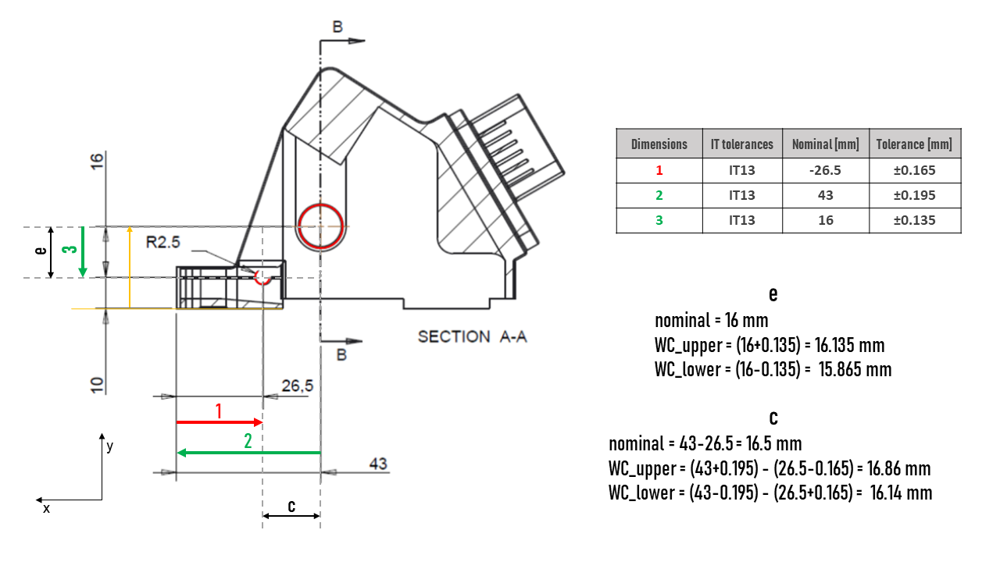
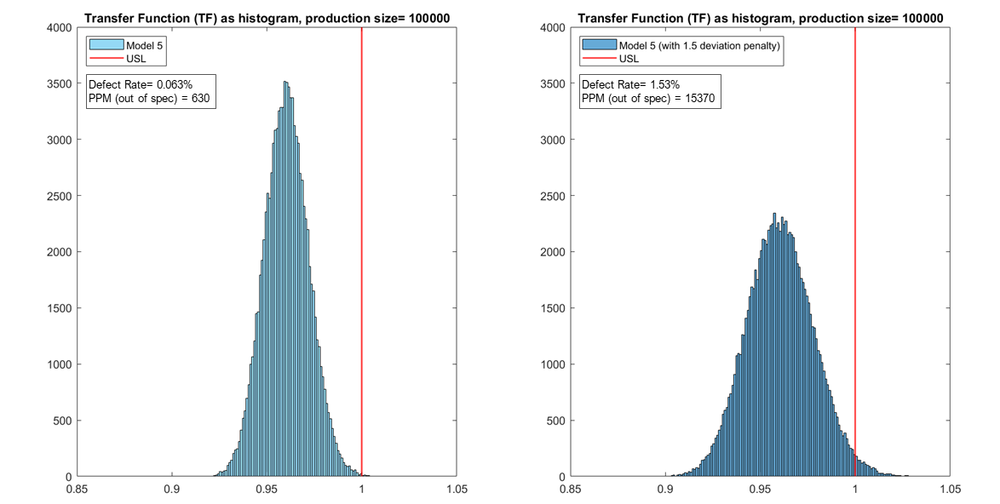

## Robustness of Toyota acceleration pedal

### DESCRIPTION
This project was one of the three assignments of the *Robust Design of Products and Mechanisms* course, at MSc level. The course provided a robust design toolbox that allows for an analysis and improvement of the robustness during product development. So to obtain products less sensible to variation effects, improving its quality and reliability.

### OBJECTIVES
The objective of the project was to investigate, and try to improve, the robustness of the Toyota acceleration pedal. This pedal was widely recalled for causing many accidents due to (<a href="https://www.cbsnews.com/news/toyota-unintended-acceleration-has-killed-89/" target="_blank">"unintended accelerations"</a>). Also, to use quantitative stack-up analysis as well as specify suitable tolerances so to ensure functionality and producibility.

### METHODOLOGY
#### TOLERANCE ANALYSIS
The project started by understanding the acceleration pedal mechanism and with a discussion on possible product failures, variation influences, and part variation. Then, some tolerance, engineering fit and statistical analyses using the production drawings of the acceleration pedal were conducted. An example of tolerance analysis is shown in *Fig.1*. 

<figure>
  
  <figcaption>Fig.1: Tolerance analysis</figcaption>
</figure>

A reflection of the tolerances and specifications was included and considered in further steps of the project.
#### TOLERANCE REDESIGN
In the second part of the project drawbacks of the current redesign were identified. Using Tolerance Design principles, a redesign of the pedal was proposed to reduce the effect of variation, hence to increase its robustness. The proposed redesign was sketched as displayed in *Fig.2*.

<figure>
  
  <figcaption>Fig.2: Redesign proposal for Toyota acceleration pedal</figcaption>
</figure>

This redesign, as well as the initial design, were later analysed with a sensitivity analysis. This analysis demonstrated that the redesign was eliminating some sources of variation.
#### SIX SIGMA ANALYSIS
Finally, a Six Sigma approach was used together with Monte Carlo simulations to calculate the number of defects in productions. Different models with different assumptions were simulated. One of the simulations is presented in *Fig.3*.

<figure>
  
  <figcaption>Fig.3: Defect rate prediction using Monte Carlo simulation</figcaption>
</figure>

### CONCLUSIONS
The project offered a great overview of how the robustness of a product can be assessed using different tools. Also, how the sources of variation can be spotted and reduced not only by more traditional methods but also by using Tolerance Design principles.

### THE TEAM
This project was performed with four fellow students of the same master. Each of us was involved in all the parts.
The members of the team were:

<a href="https://www.linkedin.com/in/rasmus-gottenborg-kajb%C3%A6k-063128149/" target="_blank">Rasmus Gottenborg Kajbæk</a> 
<a href="https://www.linkedin.com/in/jonas-weiran-xu-16a97b15b/" target="_blank">Jonas Weiran Xu</a> 
<a href="https://www.linkedin.com/in/saeid-pieki-3a5a8a84/" target="_blank">Saeid Pieki</a> 
<a href="https://www.linkedin.com/in/susana-osborne-valenzuela/" target="_blank">Susana Osborne Valenzuela</a> 

### PROJECT GRADE: 10/12 (7-point grading scale, ECTS mark=B)
[Back to other projects](../../index.md)

___
Copyright © 2020 by Adrià Baró Biosca. All rights reserved.
