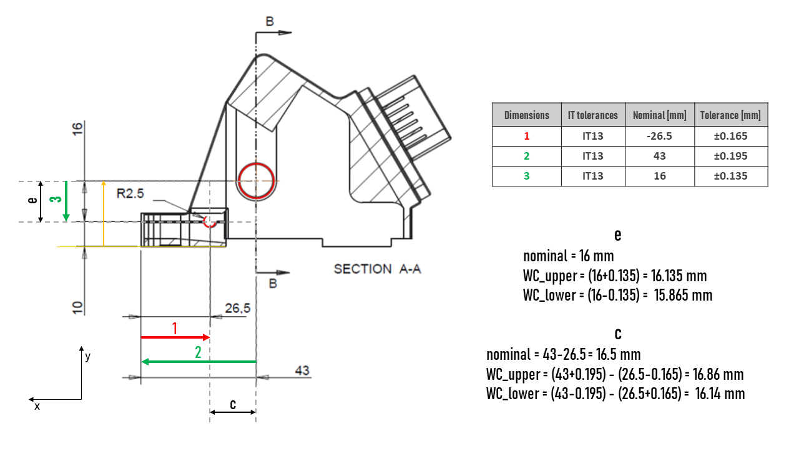
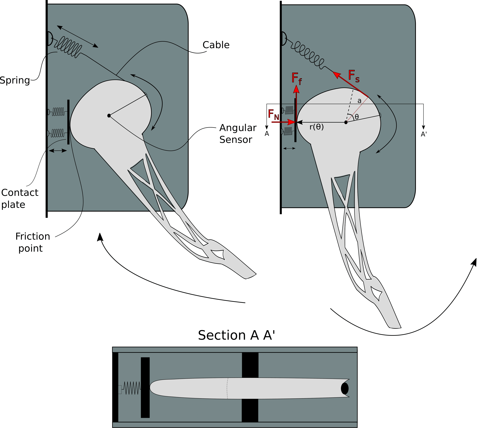
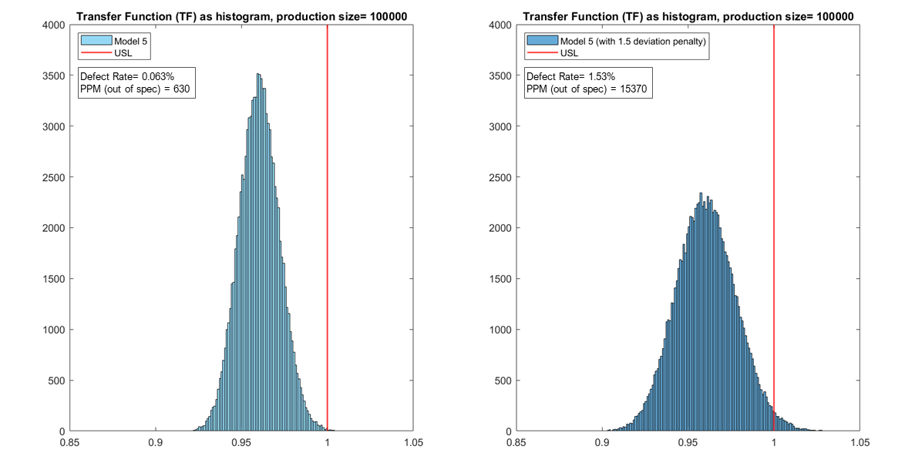

## Robustness of Toyota acceleration pedal

### DESCRIPTION
This project was one of the three assignments of the *Robust Design of Products and Mechanisms* course, at MSc level. The course provided a robust design toolbox that allows for an analysis and improvement of the robustness during product development. So to obtain products less sensible to variation effects, improving its quality and reliability.

### OBJECTIVES
The objective of the project was to investigate, and try to improve, the robustness of the Toyota acceleration pedal. This pedal was widely recalled for causing many accidents due to (<a href="https://www.cbsnews.com/news/toyota-unintended-acceleration-has-killed-89/" target="_blank">"unintended accelerations"</a>). Also, to use quantitative stack-up analysis as well as specify suitable tolerances so to ensure functionality and producibility.

### METHODOLOGY
#### TOLERANCE ANALYSIS 

<figure>
  
  <figcaption>Fig.1: Market poster</figcaption>
</figure>

#### TOLERANCE REDESIGN

<figure>
  
  <figcaption>Fig.2: Market poster</figcaption>
</figure>

#### SIX SIGMA ANALYSIS

<figure>
  
  <figcaption>Fig.3: Market poster</figcaption>
</figure>

### CONCLUSIONS

### THE TEAM
This project was performed with three fellow students of the same master. Each of us was involved in all the parts.
The members of the team were:

<a href="https://www.linkedin.com/in/rasmus-gottenborg-kajb%C3%A6k-063128149/" target="_blank">Rasmus Gottenborg Kajbæk</a> 
<a href="https://www.linkedin.com/in/jonas-weiran-xu-16a97b15b/" target="_blank">Jonas Weiran Xu</a> 
<a href="https://www.linkedin.com/in/saeid-pieki-3a5a8a84/" target="_blank">Saeid Pieki</a> 
<a href="https://www.linkedin.com/in/susana-osborne-valenzuela/" target="_blank">Susana Osborne Valenzuela</a> 

### PROJECT GRADE: 10/12 (7-point grading scale, ECTS mark=B)
[Back to other projects](../../index.md)

___
Copyright © 2020 by Adrià Baró Biosca. All rights reserved.
