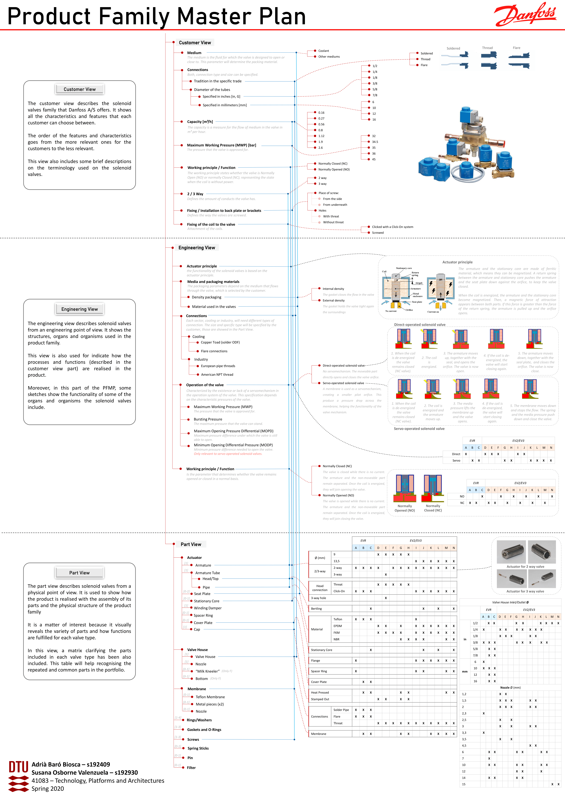
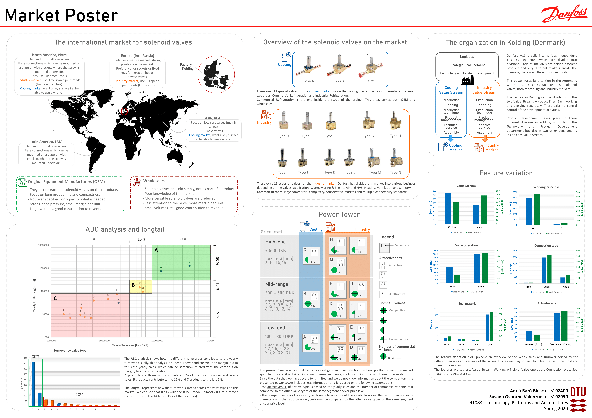
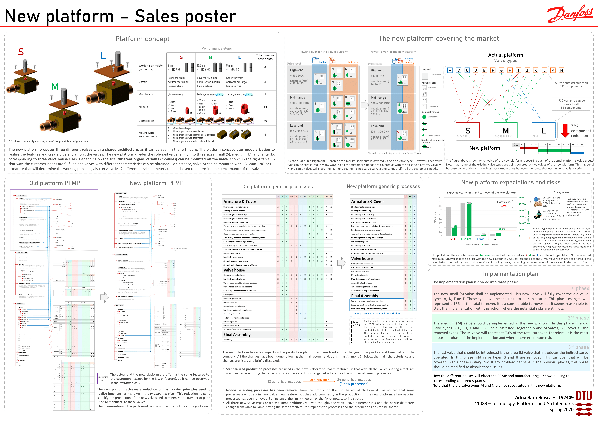

## Danfoss solenoid valves product program

### DESCRIPTION
This project was the core of the *Technology, Platforms and Architectures* course, at a MSc level. This course provided the tools and knowledge to correctly analyse a product assortment (platforms, architectures, configurators, knowledge-, data-, and product life management systems). Also, to identify goals for platform and architecture improvement. All the knowledge was tried to be applied in this real project.

### OBJECTIVES
The project was divided into two differentiated parts, each one having its objectives.
The first part main objective was to analyze the current [Danfoss](https://www.danfoss.com/en/) product program for the solenoid valves and identify improvement areas and goals for the future.
The second part aimed to propose a new product program based on the identified goals.

### METHODOLOGY
#### PART 1: What can Danfoss product program be improved?
The first part of the project consisted of a deep investigation of Danfoss current product program (market, valves design, production, sales, etc.). After having the right understanding, three posters were elaborated to provide an overview of what Danfoss was offering, to whom and how. One of the posters consisted on a Product Family Master Plan (PFMP), showing the link between customer needs and the engineering part of the solenoid valves. That poster is shown in *Fig.1*.

<figure>
  
  <figcaption>Fig.1: PFMP poster</figcaption>
</figure>

Another poster summarized the production processes and production flows of the solenoid valves. The last poster presented the solenoid valves market and the customer needs in different regions. This last poster is shown in *Fig.2*.

<figure>
  
  <figcaption>Fig.2: Market poster</figcaption>
</figure>

This first part of the project ended with a short report pointing out the main insights of the posters. Even more important, improvement areas and goals for the second part were identified.
#### PART 2: How to improve Danfoss product program?
Based on the identified goals and areas of improvement, an idea catalogue containing a set of solutions was created. Using some new ideas, an improved platform concept was designed. Finally, this new platform concept together with the main benefits, risks and important changes for applying it was summarized using a poster. This poster is presented in *Fig.3*.

<figure>
  
  <figcaption>Fig.3: Sales poster for the new platform concept</figcaption>
</figure>

### CONCLUSIONS

This project was a great opportunity to put hands on a real and quite complex product program of a well-known company. Different tools were applied to identify potential improvements and reduce costs while trying to fulfil customer needs. 

### THE TEAM
This project was performed with a fellow students of the same master. Both of us were involved in all the parts.

<a href="https://www.linkedin.com/in/susana-osborne-valenzuela/" target="_blank">Susana Osborne Valenzuela</a> 

### PROJECT GRADE: 10/12 (7-point grading scale, ECTS mark=B)
[Back to other projects](../../index.md)
___
Copyright © 2020 by Adrià Baró Biosca. All rights reserved.
