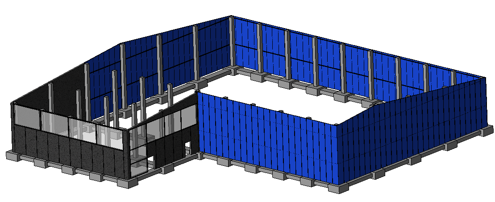

## Planning and design of an industrial building

<figure>
  
</figure>

[Back to other projects](../../index.md)

### DESCRIPTION
The project was the main focus of the *Construction Systems* course.  In this course, the most used construction techniques for industrial buildings were studied. Also, how to correctly make construction drawings using AutoCAD and to plan and design an industrial building.

### OBJECTIVES
The objectives of the project were to apply some construction techniques in a self-designed industrial building.
The planned industrial building had to have a realistic production purpose, be placed in an existing parcel of land and comply with the planning restrictions of the Municipality. Doing a structural analysis was not part of the project, however, the structure had to be down-to-earth and functional.

### METHODOLOGY
The project started by deciding the industrial activity and the building's placement.  Due to the importance of the automotive industry in Catalonia, it was decided to go for a related industrial activity. One of the main automotive manufacturers is SEAT which is located close to Barcelona. Therefore, it was chosen the industrial plant to be manufacturing automotive carpets for different SEAT models. The plant was placed close to the SEAT factory so to reduce the transportation costs.

#### CONSTRUCTION TECHNIQUES
Once...

<figure>
  
  <figcaption>Fig.1: Geometric parameters used in the DOE</figcaption>
</figure>

#### CONSTRUCTION DRAWINGS

<figure>
  
  <figcaption>Fig.2: Geometric parameters used in the DOE</figcaption>
</figure>

### THE TEAM
This project was performed with two fellow students of the same degree. Each of us was involved in all the parts. 
The members of the team were:
<a href="https://www.linkedin.com/in/nataliagimenovidal/" target="_blank">Natalia Gimeno Vidal</a> 
<a href="https://www.linkedin.com/in/nacho-sarri%C3%B3-mercad%C3%A9-9180b5ba/" target="_blank">Nacho Sarrió Mercadé</a> 

### FILES AND LINKS

 <embed src="Sistemes Constructius_BSG.pdf" type="application/pdf" width="100%" height="400px" /> 
 

### PROJECT GRADE: 9/10
[Back to other projects](../../index.md)
