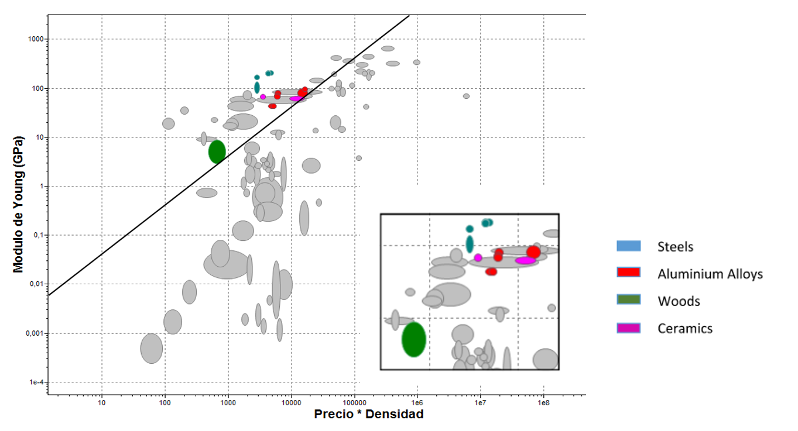
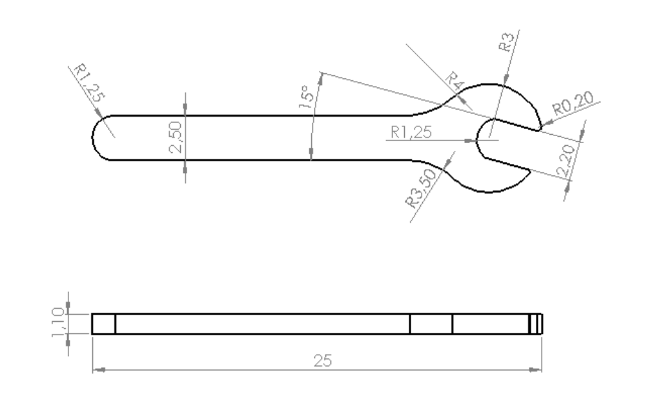
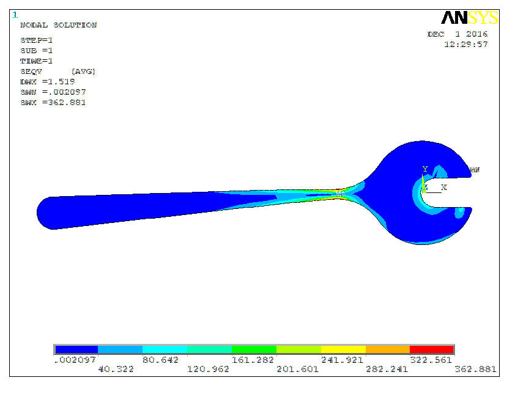
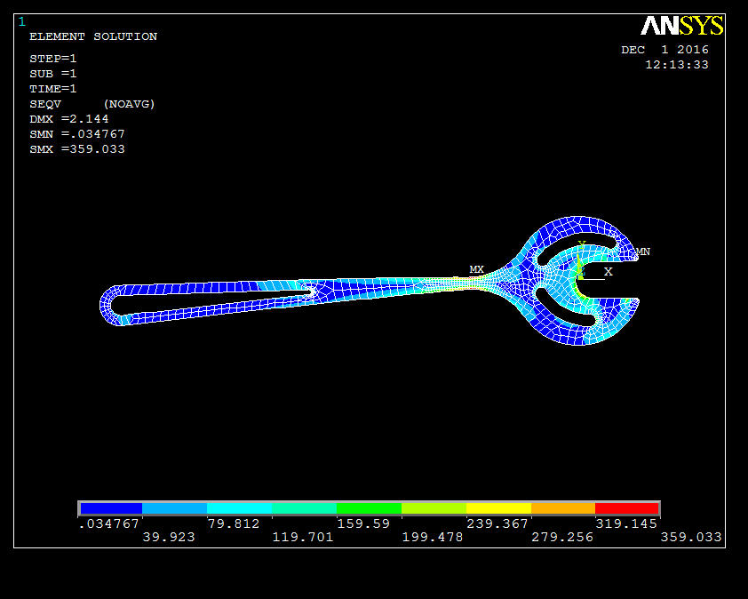
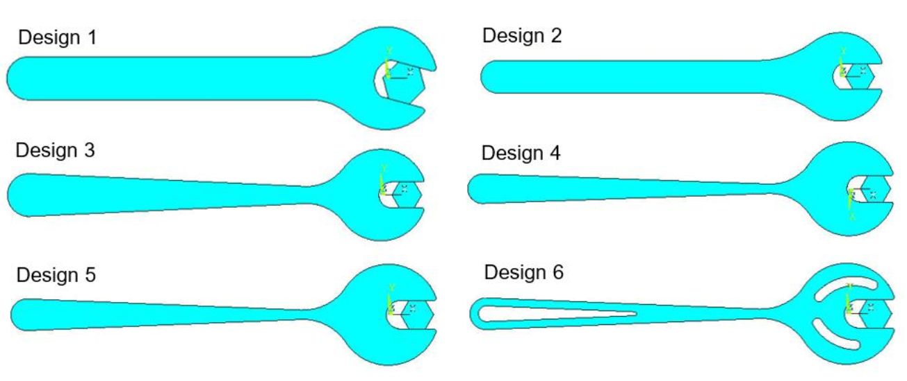
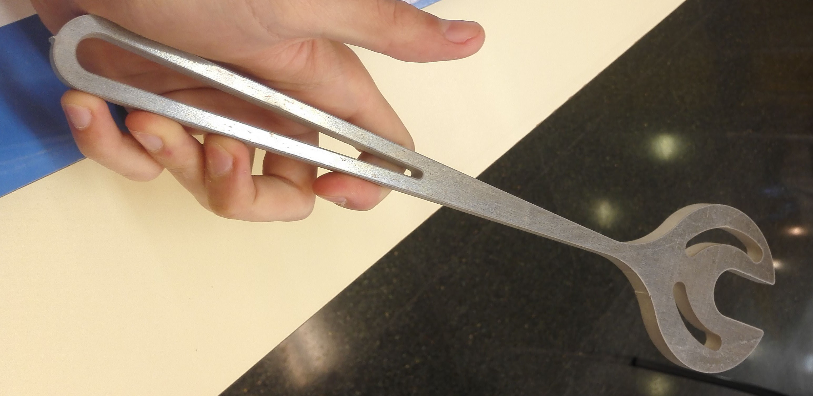

## Design of a torque-limiting spanner

### DESCRIPTION

The project was part of the course *Continuum Mechanics* in which the fundamentals of materials' elasticity and resistance were studied and applied. Even thogh finite element methods (FEM) was the core of the project, it also included material selection, design optimization and prototyping. 

### OBJECTIVES

The main objective of the project was to design and prototype a torque-limiting spanner, complying some important restrictions.  Secondary objectives were to minimize the weight and use the right material and process to manufacture it.

### METHODOLOGY
The project started with some research on the spanner dimensioning, regulations, materials and manufacturing processes. The main steps and the tools used are summarized below:

##### MATERIAL SELECTION
The material needed to fulfil several specifications, i.e. having a suitable Young's modulus or being recyclable. Other properties such as the price, isotropy or manufacturability were also considered. To choose the most appropriate material for the spanner, CES EduPack software was used.  As it is shown in *Fig.1*, the software showed the best materials which fulfilled all the requirements. 

<figure>
  
  <figcaption>Fig.1: Material selection using CES EduPack</figcaption>
</figure>

After several considerations and talking with different companies, Aluminium T651 was choosen.

##### FEM
This part started with a preliminary design which complied with the design solicitations, see *Fig.2.*

<figure>
  
  <figcaption>Fig.2: Preliminary design drawing</figcaption>
</figure>

This first design was modelled and analyzed using ANSYS, one of the most popular FEM programmes. Once the suitable analysis configuration was set (boundary conditions, mesh and forces), the results were obtained. The analyzed results were the displacement, stress distributions and Von Mises stresses, see *Fig.3* as an example.

<figure>
  
  <figcaption>Fig.1: FEM anlaysis of the preliminary design</figcaption>
</figure>

##### DESIGN OPTIMIZATION

Due to the specified restrictions, the torque-limiting spanner needed to fail once a certain torque value was achieved. To obtain the desired design, up to 6 iterations of FEM analysis and redesign were carried out. The final design FEM analysis is shown in *Fig.4*.

<figure>
  
  <figcaption>Fig.4: Final design FEM anlaysis</figcaption>
</figure>

On the other hand, each iteration also tried to reduce the weight of the spanner by removing material in those parts where the stresses were low and not critical for its functionality. The design evolution is presented in *Fig.5.*.

<figure>
  
  <figcaption>Fig.5: Spanner design evolution r</figcaption>
</figure>

### PROTOTYPE AND RESULTS

The final design of the torque-limiting spanner was protoyped. It was manufactured using a water jet cutting machine, thanks to the company [AMARI METALS IBERICA, S.L.](https://www.aalco.es/) that accepted to collaborate with the project. The prototype can be observed in *Fig.6.*.

<figure>
  
  <figcaption>Fig.6: Spanner protoype</figcaption>
</figure>

Finally, the protoype was tested in the lab to validate all the previous work. The spanner failed at the specified torque during the failure test, proving that the design process and calculations were correct.

### THE TEAM
This project was performed with two fellow students of the same degree. Each of us was involved in all the parts. 
The members of the team were: 
<a href="https://www.linkedin.com/in/jorgerodriguezllorens/">Jorge Rodríguez Llorens</a> 
Ignacio Sánchez Zárate

### FILES AND LINKS

 <embed src="Design of a torque-limiting spanner.pdf" type="application/pdf" width="100%" height="600px" /> 
 

[Back to other projects](../../index.md)
